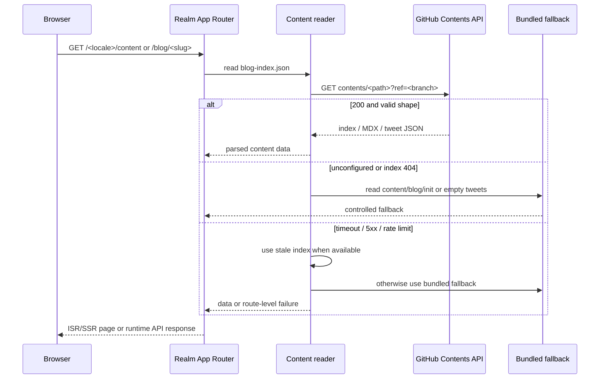
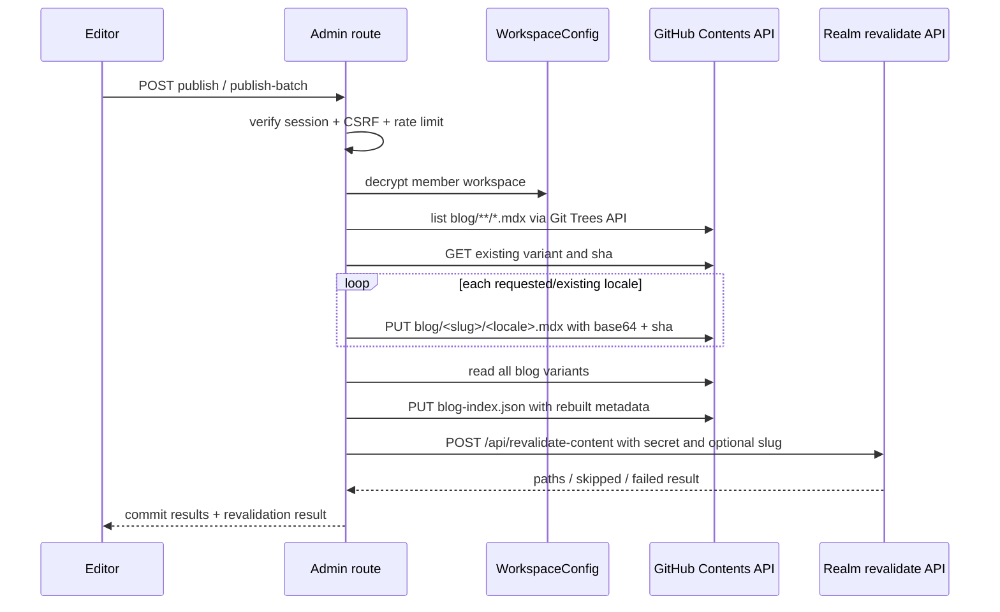

# Content 与 Admin 内容流水线

[返回文档组](./README.md)

> 文档状态：历史迁移快照。独立 `arsvine-content` 仓库已退出运行时链路；当前 Realm 只读取 `content.arsvine.com`，当前 Console 只通过 `api.arsvine.com` 访问 Core authoring API。本文的旧 GitHub 流程、回退和兼容描述不构成当前操作指引。

本文描述内容仓库、Admin 管理台和 Realm 主站之间的控制流与数据流。它不修改内容仓库，也不把 Admin 的开发预览数据当成生产内容。

## 内容面当前形态

本次从 `Arsvine-Devs/arsvine-content` 的 `main` 浅克隆得到 commit `a0237c4`。只读统计如下：

| 内容                               | 当前快照                                               |
| ---------------------------------- | ------------------------------------------------------ |
| 博客 slug                          | 8                                                      |
| 博客 MDX variant                   | 27                                                     |
| 博客 content locale                | `zh-CN`、`zh-TW`、`en`、`ja`、`ru`、`fr`               |
| protected blog                     | 1 个，`the-word-father` 的 index access mode 为 `totp` |
| 推文月度文件                       | 3 个：`2026-06`、`2026-07`、`2026-09`                  |
| 推文记录                           | 9 条，当前均为 `public`、`zh-CN`                       |
| 带翻译的推文                       | 8 条                                                   |
| 带 X origin 的当前推文             | 0 条；Schema 和 Admin 仍支持该字段                     |
| `blog-index.json` 与博客目录       | slug/locale 数量一致；所有当前 variant 均存在          |
| `tweets/index.json` 与月文件 count | 3/3 个 count 一致                                      |

`blog-index.json` 的 `updatedAt` 为 `2026-09-12T08:11:07.116Z`；数据仓库的最新提交标题为 `Rebuild blog index`。上述时间和数量是调查快照，不是运行时保证。

## 仓库格式与所有权

```text
arsvine-content/
├── blog-index.json                 # 博客列表与公开 metadata 索引
├── blog/<slug>/<locale>.mdx        # 博客正文 variant
├── tweets/index.json               # 月度推文 manifest
├── tweets/YYYY-MM.json             # 推文记录
├── mdx_translation_guide.md        # 翻译规则与提示词依据
├── scripts/generate-blog-index.mjs # 内容仓库自己的 index generator
└── package.json                    # 只有 build:index
```

博客 frontmatter 当前使用 `title`、`date`、`excerpt`、`tags`、`pinned`、`originLocale`、`updated` 和 `access`。`access.mode = totp` 时，Realm 只从 index 暴露清理后的 metadata，并在 runtime 授权后读取正文。

推文记录由 `id`、`createdAt`、`updatedAt`、`content`、`lang`、`tags`、`visibility`、`pinned`、可选 `translations` 和可选 `origin` 组成。`origin.provider = x` 时，Admin 保存 X external ID、作者、canonical URL、导入/同步时间；Realm 只把它作为来源标记与外链展示。

内容仓库是数据面。它不拥有 Admin 账户、revalidation secret、TOTP、WebAuthn、数据库或 COS Catalog。

## Realm 读取流程



Realm 的 `src/shared/lib/content/github.ts` 固定 GitHub API base，拒绝绝对路径、反斜杠、query、fragment、protocol prefix、path traversal 和控制字符。内容请求超时为 8 秒；博客 index 有约 60 秒进程内缓存，页面常用 ISR 窗口为 300 秒。

博客 detail page 对 public post 在服务端序列化 MDX；对 protected post 初始返回 `mdxSource = null`，浏览器完成 grant check/TOTP 后再访问 `/api/post-variant`。这条安全边界由 Realm 代码和测试共同持有，不能因为更换 Content provider 而取消。

推文页面首先读取 `tweets/index.json`，再并行读取月份文件；单月不可用时跳过该月，公开页面只保留 `visibility = public` 的记录。首屏读取一个月，Load More 通过 `/api/tweet-months` 取后续月份。

## Admin 内容写入流程

Admin 的 `WorkspaceConfig` 通过 `AsyncLocalStorage` 绑定到当前请求。生产工作区从 Admin Neon 的 `workspace_configs` 解密；开发预览则使用进程内 `development-preview` 数据，不访问远端服务。

### 博客发布



实现位于 Admin `lib/posts.ts` 和 `lib/github.ts`：

- slug、locale、access group、date、tag 和 commit message 在写入前规范化。
- 每个 variant 使用 GitHub Contents API 的 file `sha` 做更新条件；`409` 时对该文件重新读取 sha 后重试一次。
- batch 不是跨文件原子提交。多个 variant、`blog-index.json` 和 revalidation 是连续步骤，任何中途失败都可能留下部分已提交状态。
- `rebuildBlogIndex` 会读取整个 `blog/` 树并重新写根目录 index；它不会调用内容仓库的 `scripts/generate-blog-index.mjs`。
- public revalidation 成功后 Realm 对三个 UI locale 的 `/content` 做 `revalidatePath`，若传入合法 slug 还刷新对应 blog detail。

### 推文写入

Admin `lib/tweets.ts` 读取 `tweets/index.json` 和 Git tree 中的所有 `tweets/YYYY-MM.json`，按月聚合后：

1. 新建、更新或删除对应的月度 JSON。
2. 必要时删除已经不存在的月份文件。
3. 重写 `tweets/index.json` 的 month/path/count/updatedAt。
4. 调用 Realm `/api/revalidate` 的 POST body secret。

GitHub 文件写入同样是串行的多个 Contents API 操作，月文件和 index 之间没有单一 commit transaction。Realm 的 `/api/revalidate` 仍允许旧的 GET query secret，但 Admin 当前代码使用 POST body。

### X timeline 同步

```mermaid
sequenceDiagram
  participant S as Vercel Cron or Editor
  participant A as Admin sync route
  participant D as Admin Neon
  participant X as X API v2
  participant G as Content GitHub repo
  participant R as Realm revalidate API

  S->>A: GET /api/cron/x-timeline with CRON_SECRET
  A->>D: list active users + decrypt X workspace
  loop each configured workspace
    A->>X: GET /2/users/<id>/tweets with bearer token
    A->>X: optional GET /2/tweets?ids=... reconciliation
    A->>G: merge monthly tweet JSON by externalId
    A->>D: persist sinceId, pagination token, sync time/error
    A->>R: POST tweets revalidate when content changed
  end
  A-->>S: per-workspace result; 207 if any workspace failed
```

同步模式是 `recent` 或 `backfill`，每次最多读取 5 页；Vercel Cron 当前配置只读取 1 页。Admin 使用 `sinceId`、`paginationToken` 和 `paginationSinceId` 保存增量/回填位置，最近 48 小时的已导入 external ID 会做 best-effort lookup，X lookup 失败不会覆盖已成功获取的增量页。

X 同步不会把 X 作为 Realm 的实时运行时依赖。它把外部帖子规范化为 Content 仓库里的本地推文记录；X 不可用时，既有归档仍可由 Realm 展示。

### 翻译

Admin translation 是工作区级配置：`baseUrl`、`apiKey`、`model`、`thinking` 和 `reasoningEffort` 存入加密 `workspace_configs`。代码将 `baseUrl` 追加 `chat/completions`，发送 OpenAI-compatible request，解析结构化 JSON。

- 博客自动翻译当前固定从 `zh-CN` 生成 `zh-TW`/`en` 变体，翻译 endpoint 只返回候选内容，随后由发布流程写入 GitHub。
- 推文翻译在创建或 retranslate 时生成并写入推文 JSON，保存 source language、时间、model、prompt key 和 stale 标记。
- 当 URL 或 model 表现为 DeepSeek 时，代码增加 DeepSeek-specific `thinking`/`reasoning_effort` 字段；生产真实供应商仍为 `UNKNOWN`。

## 一致性与当前漂移

### `OBSERVED_DRIFT-01`：博客索引有两个 generator

证据：

- 内容仓库 `scripts/generate-blog-index.mjs` 明确生成每个 variant 的 `readingMinutes`。
- Admin `lib/posts.ts` 的 `toIndexItem()` 只生成 title、excerpt、tags 和 originLocale，没有生成 `readingMinutes`。
- 当前内容仓库的 `blog-index.json` 有 27 个 variant，27 个均缺少 `readingMinutes`。
- Realm `getVariantMetaFromIndex()` 在缺失时使用 `1`；读取正文后，detail 路径会重新计算阅读时间。

影响：列表/SSG metadata 可能显示默认 `1m`，detail 页面再显示正文重新计算的值；两个 generator 的字段职责和输出结果不一致。

建议：后续选择一个权威 generator 或共享可验证 schema，并明确 Admin rebuild 是否必须保留 reading-time。当前只记录，不在本次修改任何代码或内容。

### `OBSERVED_DRIFT-02`：archive 设计与当前树不一致

内容 README 和 generator 注释保留 `archive/blog/<slug>/<locale>.mdx`，generator 在 `archive/blog` 存在时会优先读取它；当前 content checkout 没有 `archive/`，实际内容全部位于 `blog/`。

影响：将来有人只创建 `archive/blog` 目录时，index generator 会切换数据源；它与 Admin 只扫描 `blog/` 的行为也不一致。

建议：后续明确 archive 是真正的数据源、纯历史目录，还是已废弃设计，并让 generator/Admin/README 共享同一条规则。

### `OBSERVED_DRIFT-03`：tweets revalidate 文案与代码不一致

Admin `.env.example` 和 README 的部分说明仍把 `PUBLIC_TWEETS_REVALIDATE_URL` 写成 GET/query secret；`lib/github.ts` 实际发送 POST JSON，Realm handler 同时兼容 GET 和 POST。POST body 是当前代码路径，能够减少 secret 进入 URL 日志的机会。

### `OBSERVED_DRIFT-04`：Admin 生产环境仍保留迁移变量

Vercel CLI 的 Admin production/preview environment key 清单仍包含 `ADMIN_PASSWORD_HASH`、`ADMIN_TOTP_JSON`、`GITHUB_WRITE_TOKEN` 等 bootstrap/legacy workspace 变量；Admin README 要求 Owner 完成 WebAuthn key login 后移除一次性 Owner password/TOTP 配置。清单还出现 `ADMIN_TOTP_DEV_BYPASS`，但当前 Admin `.env.example`、源码读取点和 `process.env` 清单中没有对应消费者。

这次只确认 key 存在，没有读取或判断 value 是否为空，也没有删除任何变量。后续应在确认 Owner 已完成迁移、旧凭据不再需要后，按生产环境变更流程审查并清理；未使用 key 则应先确认是否属于 Vercel 历史配置。

### 其他边界

- 当前 Content 仓库只有 `build:index`，没有发现 `.github/workflows` 或内容专用测试。索引/文件一致性是 Admin rebuild 和 Realm runtime validator 的间接保障。
- Realm bundled fallback 的 `content/blog/init` 只有初始文章，且与 Content 仓库当前 `init` variant 的 frontmatter/body 存在差异。它是故障兜底，不是内容镜像。
- Content GitHub token 由 Realm 作为全局只读环境变量使用；Admin 的 GitHub token 按用户保存在加密工作区中。Admin 的多工作区能力不等于当前 Realm 支持多租户公共站点。
- Vercel integration 变量与应用读取变量并不完全一一对应：Neon/Upstash 会注入多组兼容命名，代码只读取 `DATABASE_URL`、`UPSTASH_REDIS_REST_URL` 和 `UPSTASH_REDIS_REST_TOKEN` 等明确 key。迁移到 VPS 时只迁移实际消费者需要的变量，并重新验证密钥 scope。

## 当前故障边界

| 故障                                        | 影响                                                                           | 当前处理                                                   |
| ------------------------------------------- | ------------------------------------------------------------------------------ | ---------------------------------------------------------- |
| Content repo 未配置或 `blog-index.json` 404 | 博客回退到 bundled init；推文可为空                                            | Realm fallback                                             |
| Content repo timeout/5xx/限流               | 可能使用 stale blog index；首次失败时使用 bundled fallback；月份级推文独立跳过 | Realm 8 秒 timeout + cache/fallback                        |
| Admin GitHub 409                            | 内容写入冲突                                                                   | variant 写入重读 sha 重试；其他流程仍需人工重载确认        |
| Admin index rebuild 失败                    | 可能已有 variant commit，index 未更新                                          | 不触发后续成功路径的 revalidate；检查 Git history/index    |
| Realm revalidate 401/429/partial            | GitHub 已写入，页面缓存可能仍旧                                                | Admin 返回 revalidation result；按 `failed`/`skipped` 检查 |
| X API 失败                                  | 本次同步失败，既有归档保留                                                     | 记录 workspace sync error；Cron 返回 per-workspace error   |
| 翻译 endpoint 失败/非法 JSON                | 不产生有效候选翻译                                                             | Admin 返回错误；原文和既有译文不自动删除                   |
