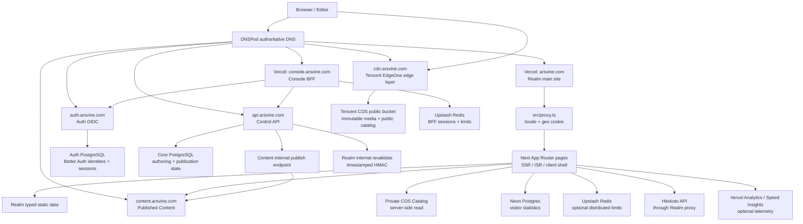

# 全系统地图与分布架构

[返回文档组](./README.md)

本文是跨仓库系统地图。主站内部的组件分层和受保护文章细节仍以 [`human/ARCHITECTURE.md`](../human/ARCHITECTURE.md) 与 [`human/SECURITY.md`](../human/SECURITY.md) 为准。

接口复核（2026-09-15）确认 `auth`、`api`、`content`、`console` 的 liveness 可达；API/Content readiness、Content 公共读面和未授权边界也已通过只读 HTTP 请求验证。认证后的 Console mutation、Realm 主站页面因未执行登录或受到外部 challenge，仍不作线上业务验收结论。

## 一句话模型

系统由公共展示面、Console 控制面、Auth 身份面、API 控制面、Content 发布读面和 CDN 资产面组成：Realm 负责展示，Console 通过 API 写入，Auth 提供 OIDC，Content 读取已发布 release，COS/EdgeOne 保存和分发媒体；Neon 与 Upstash 只承担各自明确的持久状态和限流状态。

## 全局拓扑

图中的“Vercel”表示当前公开运行证据或仓库配置；它不是未来部署的必要组成部分。`Content`、`COS`、`Neon` 和 `Upstash` 分别属于不同的数据/基础设施边界，不能因为都由 Admin 或 Realm 调用就合并成一个存储层。

Realm 对 Content 的读取发生在 Next.js 服务端：浏览器请求 Realm 页面，Realm 的 server component/route handler 再请求 `CONTENT_BASE_URL`。因此浏览器 F12 的 Network 面板通常只看到 `arsvine.com`，看不到 `content.arsvine.com`；这并不表示页面没有使用 Content API，验证应检查服务端源码、Content release header、Function 日志或受控 HTTP 探针。

## 运行单元与责任

| 单元            | 仓库/入口                                               | 运行位置                                     | 主要责任                                                                                   | 当前状态                                                                               |
| --------------- | ------------------------------------------------------- | -------------------------------------------- | ------------------------------------------------------------------------------------------ | -------------------------------------------------------------------------------------- |
| Realm 主站      | `arsvine-realm`、`src/app/`、`src/proxy.ts`             | `arsvine.com`，当前为 Vercel                 | 首页、作品、经历、Life、博客展示、推文展示、RSS、sitemap、robots、受保护内容验证和资产读取 | `CURRENT`；公开请求本次被 Vercel Bot Protection challenge 拦截，不能据此评价页面可用性 |
| Console 管理台  | `arsvine-platform`、`apps/console`                      | `console.arsvine.com`                        | OIDC BFF、Blog/Tweet 管理 UI 和 API 请求代理                                               | `CURRENT` + `LIVE`；health 与未授权 BFF 边界已验证                                     |
| Auth 身份面     | `arsvine-auth`、`apps/auth`                             | `auth.arsvine.com`                           | Better Auth identity、OIDC/OAuth、WebAuthn/Passkey、TOTP、owner/editor role                | `CURRENT` + `LIVE`；Discovery/JWKS/health 可读                                         |
| API 控制面      | `arsvine-platform`、`apps/api`                          | `api.arsvine.com`                            | JWT/JWKS resource verification、Core authoring `/v1/*` 和 Content publish                  | `CURRENT` + `LIVE`；无 Token 请求正确拒绝，OpenAPI 与 health 可读                      |
| Content 内容面  | `arsvine-platform`、`apps/content`                      | `content.arsvine.com`                        | 已发布 release、Blog/Tweet read API、protected internal variant                            | `CURRENT` + `LIVE`；release、公开 protected 403、内部 scope 校验已验证                 |
| Asset 资产面    | Realm `scripts/assets/*`、COS bucket、`cdn.arsvine.com` | 腾讯云 COS 源站 + EdgeOne/CDN 观测到的边缘层 | 原始媒体、哈希对象、私有 Catalog、公有 site catalog、字体、音频和图片分发                  | `CURRENT` + `LIVE`；公共 pointer 可读                                                  |
| Realm 数据面    | `src/features/visitor-stats/`、`db/migrations/`         | Neon Postgres                                | 匿名访客 HMAC key、总计数、日计数和基线                                                    | `CURRENT`；数据库项目/分支未知                                                         |
| Platform 数据面 | `arsvine-platform/packages/core-db`、`apps/auth`        | PostgreSQL                                   | Auth identity/session 与 Core authoring/publication state                                  | `CURRENT`；生产 database/branch 和凭据归属仍需外部配置确认                             |
| 相邻站点与活动  | 外部项目与独立域名                                      | 不属于 Realm/Platform 核心拓扑               | 由各自仓库和供应商配置独立维护                                                             | 本文不以其状态推导核心系统可用性                                                       |

## Realm 主站内部边界

### 请求与渲染

Realm 的根入口是 `src/app/layout.tsx`，在 `[locale]` 之上保持全局 client shell。`src/app/[locale]/layout.tsx` 只处理 locale 验证、服务端 `next-intl` 和 locale metadata。主要页面使用静态数据、动态服务端读取或 300 秒 ISR；Route Handler 集中在 `src/app/api/`，当前全部使用 Node runtime/dynamic handler 声明。

`src/proxy.ts` 负责 locale redirect、受支持 locale 放行和 `GEO_COUNTRY` Cookie。它通过 `@vercel/functions` 读取 Vercel Geo；自托管时这一能力没有等价的当前实现，必须替换成反向代理或应用层的明确策略。

### 领域层

`src/features/` 按领域持有 `contracts`、`model`、`server`、`ui` 和 `styles`；`src/shared/` 只保留跨 feature 的稳定能力。公共页面主要来源如下：

| 数据类别                               | 当前所有者                                                       | 读取方式                                                  |
| -------------------------------------- | ---------------------------------------------------------------- | --------------------------------------------------------- |
| 作品、经历、Life、技能、友链、站点配置 | Realm `src/features/*/contracts/` 与 `src/shared/config/site.ts` | 构建时/服务端静态 registry                                |
| 博客索引和 MDX 正文                    | Content release / COS objects                                    | Realm 服务端通过 `content.arsvine.com` 读取               |
| 推文月索引与月度 JSON                  | Content release / COS objects                                    | Realm 服务端通过 Content API 读取，再按 `visibility` 过滤 |
| 图片、音频、字体和装饰对象             | COS public bucket                                                | 浏览器使用 `cdn.arsvine.com` 的 `objectKey`               |
| Catalog 元数据                         | COS private bucket                                               | Realm 服务端读取 `current.json` 后校验 versioned sections |
| 访客计数                               | Realm Neon 数据库                                                | `/api/visitor-stats` 使用匿名签名 Cookie 和 HMAC key      |

### 主要失效隔离

- Content release/API 不可达时，Realm 使用 Content client 错误边界。
- Private Catalog 不可用时，资产 API 保留 `502` 与空 Catalog 的区别；页面使用 feature fallback。
- Upstash 未配置或暂时不可达时，限流退回单进程 Map；这保持本地可用性，但不提供多实例一致性。
- Hitokoto 失败时回退到预设文案；Telemetry 和 WebGL 失败不应阻断基础 UI。
- Protected blog 首次页面只给清理后的 metadata，正文由授权后的 runtime API 加载。

## 部署拓扑

### 当前 Vercel 形态

- Realm 的 `package.json` 提供 `pnpm build`，没有自己的 `vercel.json`；Vercel 使用 Next.js 标准构建输出。
- Realm 的 `server.js` 用于本地开发和可选自托管，不是 Vercel 的入口。
- Platform 的 `apps/console`、`apps/auth`、`apps/api` 和 `apps/content` 分别对应 Console、Auth、API 和 Content Vercel 项目；各项目的 root directory/build command 由 Vercel project 配置和对应 manifest 共同确认。

### 构建与交付

- Realm 有 `.github/workflows/ci.yml`：push 和 pull request 触发 Ubuntu `pnpm check`，并在 Windows 上执行依赖安装和 `pnpm build`。
- Platform 的当前 checkout 只保留仓库级工具和参考环境 workflow；各 Vercel 项目的自动部署规则由 Vercel project 配置确认。
- Realm 的 GitHub Actions workflow 使用 `contents: read`，属于代码质量/构建面，不参与生产请求、内容写入、COS 发布或数据库迁移。
- Vercel 项目后台的 build hook、自动部署分支和 required check 不由本地文件确认。

Vercel CLI 当前项目与历史关联：

- `arsvine-realm`、`arsvine-admin`、`arsvine-auth`、`arsvine-api` 和 `arsvine-content` 当前均由 Vercel CLI 列出，生产 URL 分别为 `https://arsvine.com`、`https://console.arsvine.com`、`https://auth.arsvine.com`、`https://api.arsvine.com` 和 `https://content.arsvine.com`；代码分支提交与生产 deployment 的对应关系需要单独执行 deployment 查询。
- `arsvine-lab`、`arsvine-docs` 和 Realm Beta 是独立项目记录；它们不属于当前五个核心 Vercel 项目。Docs 的静态输出约定、Lab 的 Next.js 运行信息和 Beta preview 记录仍保留在供应商快照中，供迁移追溯。
- Realm Beta 的历史 Vercel deployment 曾包含 `dev/x-timeline-provider-research` 的 READY preview；这证明研究分支曾被部署为候选预览，不改变当前主站和 Content 的运行边界。
- Vercel 当前团队项目清单包含 Realm、Console、Auth、API 和 Content 五个核心项目。

### Vercel integration 与环境变量证据

Realm、Console、Auth、API 和 Content 的 Vercel 环境变量按各自 `.env.example` 与当前读取器维护。未由代码读取的 provider 别名不属于应用配置；Vercel 环境变量的具体键、格式、作用域和填写来源分别见 Realm [`human/CONFIGURATION.md`](../human/CONFIGURATION.md) 与 Platform [`CONFIGURATION.md`](https://github.com/Arsvine-Devs/platform/blob/main/docs/CONFIGURATION.md)。

### 已验证的公开运行信号

本次通过公开 DNS/HTTP 只读检查得到以下信号：

- `arsvine.com`、`console.arsvine.com`、`auth.arsvine.com`、`api.arsvine.com` 和 `content.arsvine.com` 是当前核心服务域名；具体 HTTP 状态和未授权行为以最新探针为准。
- `arsvine.com` 的本次无会话请求返回 `429`，同时带 `X-Vercel-Mitigated: challenge`；这证明该请求经过 Vercel challenge，不证明主站应用本身下线。
- `cdn.arsvine.com` 的 DNS CNAME 指向 `*.eo.dnse0.com`；响应包含 `EO-Cache-Status` 和 `Server: tencent-cos`。腾讯 EdgeOne 官方文档将 `EO-Cache-Status` 定义为边缘缓存状态，并将 COS 列为常见源站 Server 值，因此资产链路按 EdgeOne/CDN → COS 记录。
- `cdn.arsvine.com/realm/site-catalog/current.json` 返回 `20260912T144508Z`；该 version 的公有 `assets.json` 当前为 `{"assets":{}}`。本地生成输出也是同一形状；这只说明 allowlisted site-catalog 记录为空，不能推断所有媒体对象不存在。
- `arsvine.com` 的权威 NS 查询返回 `lydia.dnspod.net` 和 `blithe.dnspod.net`，因此 DNSPod 作为当前权威 DNS 供应商有 `LIVE` 证据。具体账号、解析策略和 apex 记录仍未访问后台确认。
- 腾讯云控制台进一步确认 DNSPod 的完整记录分组、COS ACL/CORS/Referer/容灾状态、EdgeOne 源站/缓存/WAF/日志状态和 SSL 绑定；详见 [`TENCENT_CLOUD_SNAPSHOT.md`](./TENCENT_CLOUD_SNAPSHOT.md)。这些控制面读数按 `CLAIMED` 处理。

## 尚未确认的系统事实

- Realm 和 Admin 的 Neon Marketplace 资源已经分开，但各自 `DATABASE_URL` 对应的实际 database/branch、是否存在额外共享层仍未读取；Schema 可以共存，连接串归属仍需 Neon 后台确认。
- Platform 的五个 Vercel project、主要 environment scope 和生产 URL 已由 CLI 确认；preview protection、自动部署规则和各项目的 deployment-to-commit 对应关系仍需单独查询。
- COS 私有 Catalog 桶的生命周期规则、COS/EdgeOne 备份恢复演练、COS 盗刷告警创建与告警接收策略仍未确定；当前 ACL、CORS、Referer、版本、复制、加密、日志和主要 EdgeOne 配置见 [`TENCENT_CLOUD_SNAPSHOT.md`](./TENCENT_CLOUD_SNAPSHOT.md)。
- DNSPod 中暂停的 `docs`、`lab`、`quiz` 记录与公共 DNS 缓存的收敛时间仍需在后续清理窗口确认；Vercel 项目删除与 DNS 记录删除必须分别确认，项目域名关联不等于记录已启用。
- 已废弃独立 Content 仓库的 branch protection、Token、审查规则和 webhook 设置不再属于当前运行时；如需迁移追溯，只保留历史记录。
- 生产翻译 endpoint 的真实供应商；代码接受 OpenAI-compatible URL，示例默认值是 DeepSeek，不能当作生产事实。
- `arsvine-docs` 项目已删除；其仓库当前未提交重构的后续处置，以及公开站点是否应成为未来系统架构文档的发布面仍未决定。
