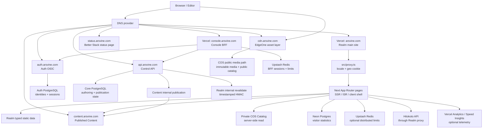

# 全系统地图与分布架构

[返回文档组](./README.md)

本文是 ARSVINE 系列站点当前的跨仓库系统地图。Realm 单仓库的组件分层和受保护文章细节以 [`human/ARCHITECTURE.md`](../human/ARCHITECTURE.md) 与 [`human/SECURITY.md`](../human/SECURITY.md) 为准。

当前公开探针结果：`console`、`auth`、`api` 和 `content` 的 liveness/readiness 均返回 200；`status.arsvine.com` 返回 200，DNS CNAME 指向 Better Stack。Realm 的 canonical health 路由受到 Vercel Bot Protection challenge，返回 429；Realm production deployment 为 READY。

## 一句话模型

系统由公共展示面、Console 控制面、Auth 身份面、API 控制面、Content 发布读面、CDN 资产面和 Status 运维观测面组成：Realm 负责展示，Console 通过 API 写入，Auth 提供 OIDC，Content 读取已发布 release，COS/EdgeOne 保存和分发媒体，Status 提供外部检测和状态展示；Neon 与 Upstash 只承担各自明确的持久状态、会话状态和限流状态。

## 全局拓扑

Status 是业务系统之外的观测面。它的检测目标、通知渠道和状态页内容由 Status 部署维护，核心业务服务不依赖 Status 站点处理请求。

Realm 对 Content 的读取发生在 Next.js 服务端：浏览器请求 Realm 页面，Realm 的 server component/route handler 再请求 `config/site-config.mjs` 中的 Content origin。因此浏览器 Network 面板通常只看到 `arsvine.com`，不会直接看到 `content.arsvine.com`；服务端源码、Content release 响应和受控 HTTP 探针是对应的验证入口。

## 运行单元与责任

| 单元              | 仓库/入口                                        | 运行位置                      | 主要责任                                                                                   | 当前状态                                                                                                    |
| ----------------- | ------------------------------------------------ | ----------------------------- | ------------------------------------------------------------------------------------------ | ----------------------------------------------------------------------------------------------------------- |
| Realm 主站        | `arsvine-realm`、`src/app/`、`src/proxy.ts`      | `arsvine.com`，Vercel         | 首页、作品、经历、Life、博客、推文、RSS、sitemap、robots、受保护内容验证和资产读取         | `CURRENT` + `LIVE`；production deployment `07c761f` 为 `READY`，canonical health 受 Bot Protection 返回 429 |
| Console 管理台    | `arsvine-platform`、`apps/console`               | `console.arsvine.com`，Vercel | OIDC BFF、Blog/Tweet 管理 UI 和 API 请求代理                                               | `CURRENT` + `LIVE`；live/ready 返回 200                                                                     |
| Auth 身份面       | `arsvine-platform`、`apps/auth`                  | `auth.arsvine.com`，Vercel    | Better Auth identity、OIDC/OAuth、WebAuthn/Passkey、TOTP、owner/editor role                | `CURRENT` + `LIVE`；live/ready 返回 200                                                                     |
| API 控制面        | `arsvine-platform`、`apps/api`                   | `api.arsvine.com`，Vercel     | JWT/JWKS 校验、Core authoring `/v1/*` 和 Content publication                               | `CURRENT` + `LIVE`；live/ready 返回 200                                                                     |
| Content 内容面    | `arsvine-platform`、`apps/content`               | `content.arsvine.com`，Vercel | published release、Blog/Tweet read API、protected internal variant 和 publication endpoint | `CURRENT` + `LIVE`；live/ready 返回 200                                                                     |
| Asset 资产面      | Realm `scripts/assets/*`、COS、`cdn.arsvine.com` | EdgeOne → COS                 | 原始媒体、hash object、private Catalog、public site catalog、字体、音频和图片分发          | `CURRENT` + `LIVE`；public pointer 可读                                                                     |
| Status 运维观测面 | Better Stack Status Page                         | `status.arsvine.com`          | 核心站点和服务的外部健康检测、状态展示                                                     | `LIVE` + `CLAIMED`；CNAME 和页面 HTTP 200 已确认，具体检测项未读取                                          |
| Realm 数据面      | `src/features/visitor-stats/`、`db/migrations/`  | Neon Postgres                 | 匿名访客 HMAC key、总计数、日计数和 baseline                                               | `CURRENT`；database/branch 未读取                                                                           |
| Platform 数据面   | `packages/core-db`、`apps/auth`                  | PostgreSQL via Neon           | Auth identity/session 与 Core authoring/publication state                                  | `CURRENT`；database/branch 未读取                                                                           |

## Realm 主站内部边界

### 请求与渲染

Realm 的根入口是 `src/app/layout.tsx`，在 `[locale]` 之上保持全局 client shell。`src/app/[locale]/layout.tsx` 处理 locale 验证、服务端 `next-intl` 和 locale metadata。主要页面使用静态数据、动态服务端读取或 300 秒 ISR；Route Handler 集中在 `src/app/api/`，当前使用 Node runtime/dynamic handler。

`src/proxy.ts` 负责 locale redirect、受支持 locale 放行和 `GEO_COUNTRY` Cookie。它通过 `@vercel/functions` 读取 Vercel Geo；自托管时需要由反向代理或应用层提供明确的等价策略。

### 领域层

`src/features/` 按领域持有 `contracts`、`model`、`server`、`ui` 和 `styles`；`src/shared/` 只保留跨 feature 的稳定能力。

| 数据类别                               | 当前所有者                                                       | 读取方式                                                  |
| -------------------------------------- | ---------------------------------------------------------------- | --------------------------------------------------------- |
| 作品、经历、Life、技能、友链、站点配置 | Realm `src/features/*/contracts/` 与 `src/shared/config/site.ts` | 构建时/服务端静态 registry                                |
| 博客索引和 MDX 正文                    | Content release / COS objects                                    | Realm 服务端通过 `content.arsvine.com` 读取               |
| 推文月索引与月度 JSON                  | Content release / COS objects                                    | Realm 服务端通过 Content API 读取并按 `visibility` 过滤   |
| 图片、音频、字体和装饰对象             | COS public media path                                            | 浏览器使用 `cdn.arsvine.com` 的 `objectKey`               |
| Catalog 元数据                         | COS private Catalog                                              | Realm 服务端读取 `current.json` 后校验 versioned sections |
| 访客计数                               | Realm Neon database                                              | `/api/visitor-stats` 使用匿名签名 Cookie 和 HMAC key      |

### 主要失效隔离

- Content release/API 不可达时，Realm 使用 Content client 错误边界。
- Private Catalog 不可用时，资产 API 保留 `502` 与空 Catalog 的区别；页面使用 feature fallback。
- Upstash 未配置或暂时不可达时，限流退回单进程 Map；多实例场景不提供全局限流保证。
- Hitokoto 失败时回退到预设文案；Telemetry 和 WebGL 失败不阻断基础 UI。
- 受保护博客首次页面只给清理后的 metadata，正文由授权后的 runtime API 加载。

## Vercel 项目设置与生产 deployment

| Vercel project    | rootDirectory  | install command                  | build command                             | output |
| ----------------- | -------------- | -------------------------------- | ----------------------------------------- | ------ |
| `arsvine-realm`   | 空             | Vercel 默认流程                  | Vercel 默认 Next.js 构建                  | 默认   |
| `arsvine-admin`   | `apps/console` | Vercel 默认流程                  | Vercel 默认 Next.js 构建                  | 默认   |
| `arsvine-auth`    | `apps/auth`    | `pnpm install --frozen-lockfile` | `pnpm build`                              | 默认   |
| `arsvine-api`     | `apps/api`     | `pnpm install --frozen-lockfile` | `pnpm --filter @arsvine/api... build`     | `dist` |
| `arsvine-content` | `apps/content` | `pnpm install --frozen-lockfile` | `pnpm --filter @arsvine/content... build` | `dist` |

当前五个 production deployment 均为 `READY`，并使用各自主分支基线：

| 项目              | commit    | ref      | 生产域名              |
| ----------------- | --------- | -------- | --------------------- |
| `arsvine-realm`   | `07c761f` | `master` | `arsvine.com`         |
| `arsvine-admin`   | `4479147` | `main`   | `console.arsvine.com` |
| `arsvine-auth`    | `4479147` | `main`   | `auth.arsvine.com`    |
| `arsvine-api`     | `4479147` | `main`   | `api.arsvine.com`     |
| `arsvine-content` | `4479147` | `main`   | `content.arsvine.com` |

Realm 的 `.github/workflows/ci.yml` 在 Ubuntu 运行 `pnpm check`，在 Windows 运行依赖安装和 production build；`master` 的 active ruleset 要求 `verify` 和 `Vercel` 状态。Platform 的 Compose workflow 是独立的参考环境，不属于五个 Vercel service 的生产部署入口。

## 环境变量与固定拓扑

固定 service origin、resource、OIDC endpoint 和 publication pointer 由 Realm `config/site-config.mjs` 与 Platform `@arsvine/site-config` 拥有；动态 secret、凭据和运行时开关按各自 `.env.example` 与 environment provider 维护。

五个 Vercel production environment 的键名与动态契约一致；固定拓扑键已清除。详细填写格式、scope、secret 可见性和失败行为见 Realm [`human/CONFIGURATION.md`](../human/CONFIGURATION.md) 与 Platform [`CONFIGURATION.md`](https://github.com/Arsvine-Devs/platform/blob/main/docs/CONFIGURATION.md)。

## 已验证的公开运行信号

- `console.arsvine.com/health/live`、`/health/ready`、`auth.arsvine.com/health/live`、`/health/ready`、`api.arsvine.com/health/live`、`/health/ready`、`content.arsvine.com/health/live` 和 `/health/ready` 均返回对应的 JSON `200`。
- `arsvine.com/api/health/live` 和 `/api/health/ready` 返回 `429` 与 `X-Vercel-Mitigated: challenge`；production deployment inspect 显示 `READY`。
- `status.arsvine.com` 的 DNS CNAME 为 `statuspage.betteruptime.com`，页面公开请求返回 HTTP 200。
- `cdn.arsvine.com` 的服务 origin 由静态配置指向 CDN；媒体和 Catalog 的具体对象状态以当前 public pointer 和受控探针为准。

## 当前待确认事项

- Neon 资源的实际 database、branch、备份策略和连接归属仍需从 Neon 控制面确认；当前资源映射为 `neon-pink-ball`→Realm、`neon-camel-candle`→Console/Auth/API。
- Vercel preview protection、各项目 Git 自动部署规则和 deployment protection 的完整设置仍需从对应控制面确认；项目构建设置和当前 production deployment 已确认。
- DNSPod zone 记录、证书绑定与续期控制面的完整当前状态仍需从 DNSPod/腾讯云控制面确认。
- Better Stack 的实际 monitor 列表、探针路径、通知渠道和告警阈值仍需从 Status 控制面确认。
- Realm canonical health 路由受到 Bot Protection challenge；Status 的检测配置需要使用已允许的探针策略或其他可验证的 deployment health 入口。
