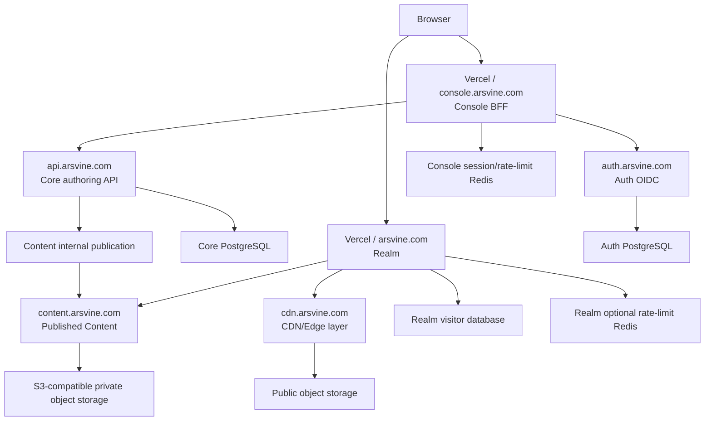

# 全系统地图与分布架构

[返回文档组](./README.md) · [Realm 架构](../human/ARCHITECTURE.md) · [Platform 仓库](https://github.com/Arsvine-Devs/platform)

本文是 Realm 与 Platform 的当前跨仓库地图。应用行为和环境变量的详细说明分别由两个仓库的当前文档和 `.env.example` 拥有。

## 一句话模型

Realm 负责公开展示和资产消费；Console 负责管理界面与 BFF；Auth 负责身份；API 负责 Core authoring 和发布编排；Content 负责已发布 release read plane；CDN 负责公共媒体分发。

## 当前拓扑

## 数据所有权

| 数据                                             | 当前所有者                                                       | 读取/写入方向                                |
| ------------------------------------------------ | ---------------------------------------------------------------- | -------------------------------------------- |
| 作品、经历、Life、技能、友链和站点配置           | Realm `src/features/*/contracts/` 与 `src/shared/config/site.ts` | Realm 构建和服务端读取                       |
| Blog/Tweet authoring、revision 和 publish state  | Platform `@arsvine/core-db`                                      | Console BFF → API → Core DB                  |
| Published Blog/Tweet release                     | Platform `apps/content` 与 private object storage                | API 发布；Realm 通过 `CONTENT_BASE_URL` 读取 |
| 身份、OIDC client、Passkey、TOTP 和 Auth session | Platform `apps/auth` 与 Auth DB                                  | Console/OIDC client → Auth                   |
| 公共图片、音频、字体和 Catalog pointer           | Realm asset workflow 与 public storage/CDN                       | Realm 服务端构建；浏览器 CDN 读取            |
| Realm visitor statistics                         | Realm visitor database                                           | Realm canonical production host 写入         |

## 信任边界

- 浏览器只访问 Realm 页面、公共 CDN 和 Console 同源 BFF；它不持有服务端 secret。
- Console BFF 只把 OIDC access token 发送给 API，并在写入前验证 session 与 CSRF。
- API 通过 `@arsvine/authz` 验证 Auth JWT，并按 scope 保护 authoring 和 publication。
- Content 公共 endpoint 清理 protected metadata；受保护 variant 需要 `content:protected:read`。
- Realm 受保护正文先验证 visitor grant，再由服务端使用 client-credentials 访问 Content。
- Revalidation 使用时间戳 HMAC；发布 pointer 只在对象验证完成后切换。

## 交付和验证

当前服务的命令、配置和健康探针由 Platform 的 `docs/OPERATIONS.md` 维护；Realm 的应用、资产和 revalidation 操作由 [`docs/human/OPERATIONS.md`](../human/OPERATIONS.md) 维护。

本地 `pnpm check` 和 `corepack pnpm check` 只证明对应仓库的本地门禁。它们不替代已认证的 OIDC mutation、Content publish、数据库写入、生产域名或外部供应商验收。

## 已退出的路径

- 独立 `arsvine-content` 仓库是一次性历史输入，不是 Realm 或 Platform 的运行时依赖。
- Realm 不再包含仓库内 Blog fallback 或 GitHub Content reader。
- Platform 不再提供 Console repository panel、X timeline cron、旧页面 redirect 或未部署 worker 503 路径。
- `apps/api/scripts/import-content-release.mjs` 是一次性迁移工具，已从当前工作区移除；应用数据库 migration 仍由 `migrate-core.mjs` 负责。

历史导入和迁移背景见 [`CONTENT_ADMIN_PIPELINE.md`](./CONTENT_ADMIN_PIPELINE.md)；不要把历史流程当成当前操作步骤。
