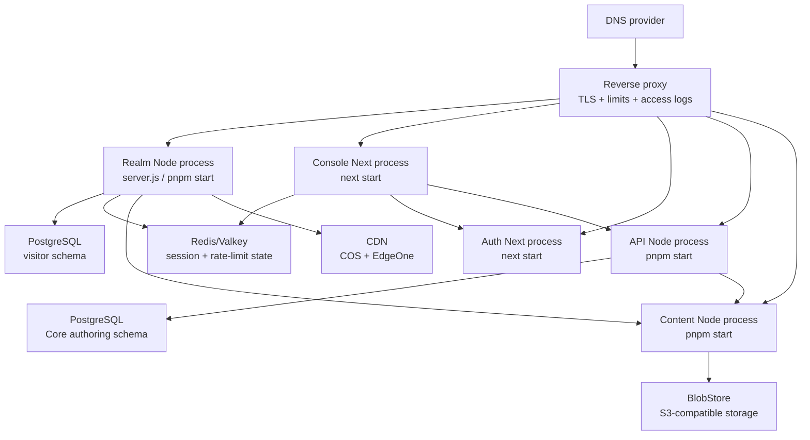

# VPS 与供应商迁移路线

[返回文档组](./README.md)

本文是未来迁移的边界和顺序说明，不是本次执行授权。当前不迁移数据库、内容、COS、DNS、域名、部署或供应商账户。临时 `anti-fraud-quiz` 是独立活动站，生命周期结束后按独立清理流程处理，不纳入 VPS 迁移目标。

## 迁移目标

目标是让应用运行时可以从 Vercel 移到 VPS，同时保留已有用户可见行为和数据语义；供应商替换可以分批进行。最先脱离的应该是托管运行时，最后再决定是否迁移 GitHub、COS/EdgeOne 和外部数据源。

## 推荐迁移顺序

### 1. 建立可回滚的基线

迁移前单独保存并验证：

- Realm、Admin、Content 的 Git refs 和完整历史；Content 不应只保留浅克隆。
- Admin 数据库的 schema、账户、加密 workspace、WebAuthn credentials/challenges 和 account events。
- Realm 访客统计表和 baseline。
- COS public/private bucket 的所有 pointer、versioned Catalog、immutable object 和 raw media/staging source。
- 所有域名的 DNS zone、证书、CORS/Referer、缓存规则和当前供应商后台配置；腾讯云快照见 [`TENCENT_CLOUD_SNAPSHOT.md`](./TENCENT_CLOUD_SNAPSHOT.md)。
- secret/Token 的新存储位置、轮换计划和最小权限；不要把它们放进 Git 或镜像。

这一步的完成标准是能够回答“某一份内容、某一组资产、某一个数据库状态从哪里恢复”，而不是仅成功启动 VPS。

### 2. 先只替换 Vercel 运行时

保留 Neon、Upstash、COS、EdgeOne 和 DNSPod，先让 VPS 承担 Realm、Console、Auth、API、Content 五个应用进程。临时 quiz 不随核心系统迁移；若活动尚未结束，应保持其独立的 Vercel/Redis 入口：

- Realm 运行 `pnpm install --frozen-lockfile`、`pnpm build` 和 `pnpm start`；Realm 的 `start` 会经过 `server.js`。
- Console、Auth 分别运行各自的 Next `pnpm build` 与 `pnpm start`。
- API、Content 运行各自的 TypeScript build 和 Node `pnpm start`。
- 反向代理负责 HTTPS、host/protocol、请求体大小、慢连接、访问日志、静态缓存和必要的 WAF/rate limit。
- Realm 自托管时只在反向代理确实覆盖 forwarding headers 的情况下设置 `TRUST_PROXY=1`；否则保留未信任模式。
- quiz 活动结束后删除项目和自定义域名关联，清理自己的 Redis prefix/keys；不要删除 Realm/Admin 共用的 Upstash resource，也要先复核历史 Beta 关联。

Next.js 官方支持使用 Node server 或 Docker 自托管，并建议在 Next server 前放置 reverse proxy。见 [Next.js self-hosting](https://nextjs.org/docs/app/guides/self-hosting)。

### 3. 保留当前无调度器的边界

当前 Platform 没有内容同步 Cron 或 X worker。只有在重新批准周期性输入任务后，才把它作为独立迁移项目接入 systemd timer、宿主机 cron 或独立 worker，并保持：

- `Authorization: Bearer <CRON_SECRET>` 认证；
- daily cadence 和 UTC/Asia/Shanghai 的明确换算；
- 每个 workspace 的独立结果和错误记录；
- `sinceId`、`paginationToken`、`paginationSinceId` 的保存；
- X API、GitHub 内容写入和 revalidation 的已有失败边界。

Vercel 官方说明 Cron 失败不会自动重试，可能发生重复投递或重叠运行；VPS 版本应在触发层增加单实例 lock，并在 merge/write 层保持幂等。不要把“更容易运行 cron”扩展成未经需要的队列或恢复系统。

### 4. 迁移 Neon 到 PostgreSQL

应用层需要的是真正的 PostgreSQL 语义，不是 Neon 品牌：

- Admin 执行 `drizzle/` 中的 migrations，验证唯一 Owner、外键 cascade/set-null、WebAuthn challenge 单次消费、session version 和 workspace upsert。
- Realm 执行 `db/migrations/0001_visitor_stats.sql`，验证新 identity/日访问/总计数的 CTE 原子行为、Asia/Shanghai 日界线和 baseline 幂等。
- 决定两个 schema 是共用一个 PostgreSQL 实例、共用 database 的不同 schema，还是完全分离；当前仓库没有替用户决定这个部署拓扑。
- 将 Realm 的 `@neondatabase/serverless` 与 Platform 的 `pg`/Drizzle 连接点替换为目标 PostgreSQL driver/pool，并保持参数化查询、连接释放、事务和超时。
- 迁移完成后用只读查询和应用测试验证计数/认证，确认旧数据库仍可回滚读取，再切换 `DATABASE_URL`。

Neon branching 可以帮助原环境做隔离和恢复，但换到 VPS 后仍要建立自己的 backup、restore、point-in-time 或 snapshot 方案；不要把 Neon branch 名称当成应用协议。

### 5. 替换或保留 Upstash

单 VPS 的进程内 Map 可以降低成本，但它不能等价替代多实例限流。若未来保留多进程、多机或 Admin Cron：

- 优先部署 Redis/Valkey，继续使用 `INCR`、首次 `EXPIRE`、PTTL 修复和同一组 key；或编写极薄的 `RateLimiter` adapter。
- 明确 Redis 不可用时是否继续 fail-open。Realm 的 TOTP/revalidation 可用性与安全边界需要分别评估，不能只把云供应商替换成 local Map。
- 保留每个 route 的 limiter 名称、窗口、上限和 `Retry-After`。

### 6. 迁移 Content 服务与历史输入

换 VPS 时先保持 Content service 的 published release、current pointer 和 object storage 边界；独立 Content 仓库是一次性迁移输入，不是新的 VPS runtime。第一阶段可以继续使用现有 Content API 和 COS，避免同时改变 Realm 的读取边界。

如果需要完全替换 Content storage，按以下顺序实现 `PublishedContentReader`/`BlobStore` 的新实现：

1. 定义 release、manifest、pointer 和 protected variant 的安全 contract。
2. 复制 immutable objects 和 versioned Catalog，先验证无损读出。
3. 保留公开/受保护正文隔离、tweet month index、pointer-last 和 revalidation。
4. 先让 Content read plane 只读新 storage，再验证 Realm 读取和回滚。
5. 只有在明确 authoring owner 后，才切换 API 的 publication destination。

历史 GitHub 输入的 repo-relative path、branch/ref、compare-and-swap、commit/audit 和 conflict 语义见 `CONTENT_ADMIN_PIPELINE.md`；它们只作为迁移资料，不重新开放为当前运行时入口。

### 7. 保留 COS/EdgeOne，再决定资产迁移

资产当前已有稳定语义：`catalogKey` 是业务 identity，hash `objectKey` 是发布产物，`current.json` 是 pointer，public/private Catalog 是两份不同可见性层。腾讯云控制台显示公共媒体桶和私有 Catalog 桶均为私有读写；EdgeOne 直接回源公共媒体桶。迁移应用运行时后可以继续使用这些对象。

如果以后替换 COS/EdgeOne：

- 先复制所有 immutable object 和 versioned Catalog，不先改业务数据中的 `catalogKey`。
- 实现 `BlobStore` 的 get/put/list/head/metadata 能力。
- 用新的 CDN 保持 public object 的 HTTPS、CORS、Referer、cache-control、字体 content-type 和 immutable cache。
- 保留 pointer-last：完整版本可读、public/private 清单校验、pointer 切换、应用 revalidation。
- 至少保留一个旧版本可回滚窗口；应用 rollback 与 asset pointer rollback 是两个独立操作。
- 当前 EdgeOne 的两条媒体缓存规则、强制 HTTPS、WAF/频控和字体 CORS 响应头都属于迁移验收项；不能只验证 COS 对象可读。

当前 `cos-workspace/` 是被忽略的本地 staging/生成区，包含原始媒体和 Catalog metadata。它必须在迁移前被归档到明确的私有持久存储，否则只有代码和 public objects 不能完整重建未来资产发布。

### 8. 迁移域名与边缘层

顺序建议：

1. 用临时 hostname 验证 VPS Realm/Admin/Docs，不改变 WebAuthn production origin。
2. 在反向代理上配置与现有 host 对应的 TLS、CSP、HSTS、CORS 和 forwarding headers。
3. 降低 DNS TTL，准备 `arsvine.com`、`console.arsvine.com`、`auth.arsvine.com`、`api.arsvine.com`、`content.arsvine.com` 的记录变更；`cdn.arsvine.com` 先保持独立。`quiz.arsvine.com` 属于临时活动记录，不纳入长期切换批次。
4. 先切 Console/Auth/API/Content 的受控入口，再切 Realm apex；每次记录 HTTP、auth、revalidate、content、asset 和 rollback 结果。
5. DNS 切换后保留旧 Vercel deployment 直到 cookie、ISR、CDN 和 revalidation 观察窗口结束。

Auth Passkey 的 `PASSKEY_RP_ID`/`PASSKEY_ORIGIN` 是安全契约。若继续使用 `auth.arsvine.com`，切换托管商不应改变 origin；若改变 origin，必须把它作为独立的凭据迁移项目处理。

## 迁移前需要先解决的事实

| 事项                                                    | 当前状态         | 需要的决定/证据                                                                                                   |
| ------------------------------------------------------- | ---------------- | ----------------------------------------------------------------------------------------------------------------- |
| Admin 与 Realm 是否共用 Neon project/database           | `PARTIAL`        | Vercel Marketplace 已显示两条独立 Neon 资源；仍需 Neon 后台确认实际 project/branch、备份责任和权限边界            |
| Platform 五个 Vercel project 与 deployment 规则         | `PARTIAL`        | CLI 已确认核心项目、Node `24.x` 和生产 URL；仍需 preview protection、自动部署规则和 deployment-to-commit 对应关系 |
| Content 仓库是否启用 branch protection、required review | `UNKNOWN`        | GitHub repository settings 和 token permissions                                                                   |
| COS versioning、生命周期、public/private policy         | `PARTIAL`        | 腾讯云快照已确认 ACL、版本、复制、公共桶生命周期；私有桶生命周期和恢复演练仍需补证据                              |
| EdgeOne cache/WAF/CORS/Referer 规则                     | `PARTIAL`        | 腾讯云快照已记录站点、源站、缓存规则、WAF、CORS/Referer 和日志；带真实 Origin 的迁移验收仍未执行                  |
| DNSPod zone、证书与域名注册生命周期                     | `PARTIAL`        | 控制台已确认记录分组、域名到期/自动续费和证书绑定；切换演练与备份恢复仍未执行                                     |
| 生产 translation provider                               | `UNKNOWN`        | Admin workspace 中的 provider 类型、计费、数据处理约束                                                            |
| Content index 的权威 generator                          | `OBSERVED_DRIFT` | 统一 `readingMinutes`、archive 行为和 schema 验证                                                                 |
| 公开架构文档的未来发布面                                | `UNKNOWN`        | 当前架构文档保存在 Realm；是否另设公开发布面需要单独决定                                                          |

## 迁移 readiness 记录

下表只记录本次已完成的调查，不把未执行的迁移步骤标成通过。

| 能力                                                  | 状态               | 证据                                                                                    |
| ----------------------------------------------------- | ------------------ | --------------------------------------------------------------------------------------- |
| Realm 可生成标准 Next.js production output            | `CURRENT`          | `package.json` 的 build/start，现有 `server.js`                                         |
| Admin 可生成标准 Next.js production output            | `CURRENT`          | `arsvine-admin/package.json` 的 build/start                                             |
| Docs 可构建静态输出                                   | `CURRENT`          | `arsvine-docs/vercel.json` 与 package scripts                                           |
| Realm/Platform production deployment 与主分支基线对齐 | `UNKNOWN`          | 当前 CLI 项目清单已确认；具体 deployment-to-commit 对应关系需要单独查询                 |
| Vercel Marketplace Neon/Upstash 资源关系已确认        | `PASS`             | Realm/Admin 各自 Neon；Upstash 资源此前连接 Realm、Realm Beta、Admin，Beta 项目现已移除 |
| 腾讯云 DNS/COS/EdgeOne/SSL 控制面已记录               | `CLAIMED`          | 已登录控制台的只读快照；详见 `TENCENT_CLOUD_SNAPSHOT.md`                                |
| Content published release 可被本地服务读取            | `CURRENT`          | Platform Content read plane、对象存储 adapter 和 readiness 约定                         |
| 内容/索引 generator 完全统一                          | `NOT_RUN`/漂移存在 | 两个 generator 输出字段不同                                                             |
| Neon backup/restore 已演练                            | `NOT_RUN`          | 仓库没有远端数据库操作证据，本次未执行生产数据库操作                                    |
| COS raw source 完整可从干净 checkout 重建             | `UNKNOWN`          | raw source 依赖 ignored `cos-workspace/`                                                |
| VPS 反向代理、TLS、Cron、Redis、PostgreSQL 已部署     | `NOT_RUN`          | 本次没有创建 VPS 或外部资源                                                             |
| DNS cutover 已验证                                    | `NOT_RUN`          | 本次只读查询 DNS；没有修改记录                                                          |
| 临时 quiz 活动站已清理                                | `NOT_RUN`          | 活动生命周期与核心系统分开；不删除共享 Upstash resource                                 |

## 适合当前阶段的最小动作

在真正决定迁移之前，持续收益最高的工作是把事实和边界固定下来：统一 Content index contract、归档 COS 原始输入、取得数据库/供应商后台的脱敏拓扑，并用环境契约、发布验证和存储边界检查减少重复判断。代码抽象应跟随已批准的迁移项目进入对应仓库，不为尚未决定的供应商预先建立通用框架。
